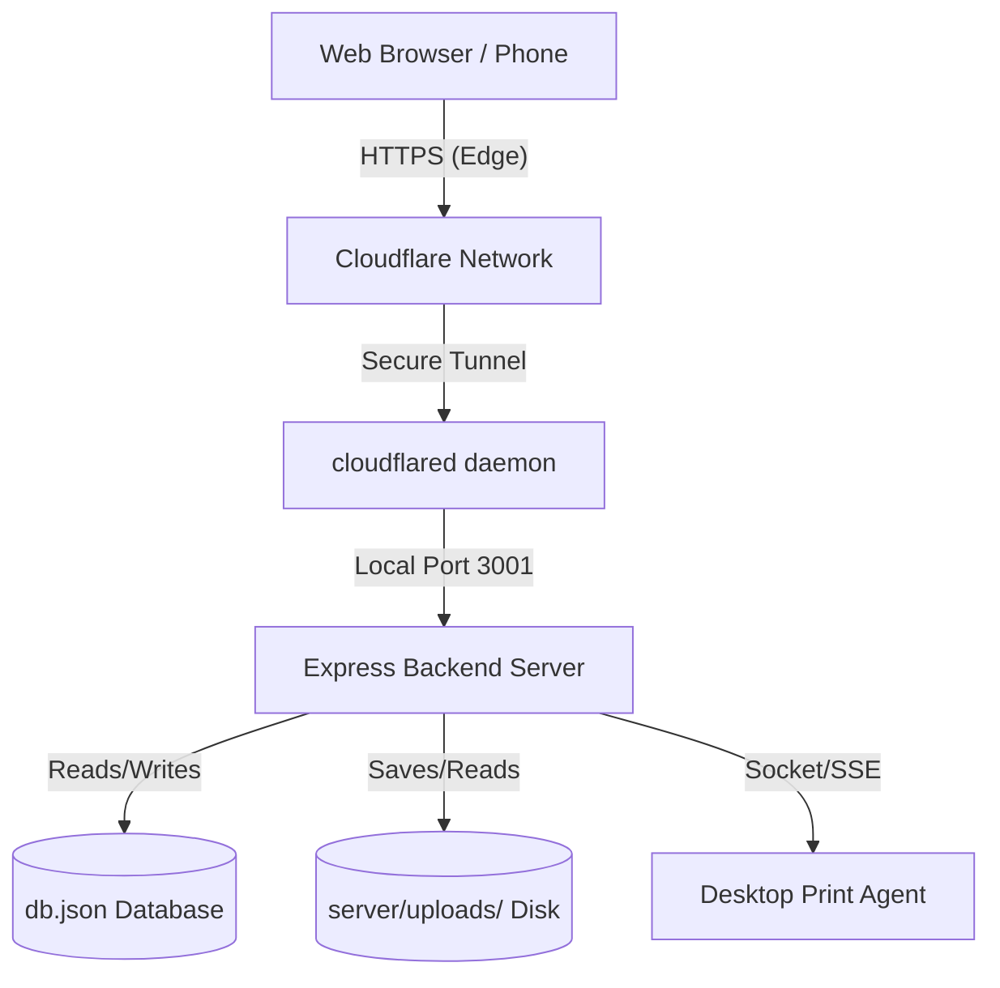

# Production Hosting Guide: Cloudflare Tunnel

This guide explains how to host and expose the **Campus Print** application publicly on the internet using **Cloudflare Tunnel (`cloudflared`)**.

Because the backend of Campus Print is stateful (utilizing a local JSON-based database at `server/data/db.json` and a local disk storage directory at `server/uploads/`), traditional serverless hosting (e.g., Cloudflare Workers or Pages Functions) is not natively supported without a massive database/storage rewrite. 

Using Cloudflare Tunnel, you can run the application on a server with persistent storage (such as a local PC in the print shop, a home lab, or a standard virtual private server) and expose it securely to a public domain without modifying the codebase, opening firewall ports, or purchasing a public static IP address.

---

## Architecture Overview

When deployed in production, the system functions as a unified host:
1. The Vite/React frontend is compiled into a static `dist/` directory.
2. The Express server serves both the static frontend files and routes `/api/*` and `/uploads/*` requests from the same port.
3. A Cloudflare Tunnel secure connection is established between the host machine and the Cloudflare edge network, forwarding public HTTPS requests to the local port.



---

## Prerequisites

1. A Cloudflare account with a domain added (e.g., `yourdomain.com`).
2. A host machine (Windows, Linux, or macOS) running the production backend.
3. Node.js (v18+) and npm installed on the host machine.

---

## Step 1: Prepare the Production Build

1. Build the Vite React frontend on the host machine:
   ```bash
   npm run build
   ```
   This compiles the web applications and outputs them to the `dist/` directory.

2. Verify that the production server runs locally:
   * **On Windows (PowerShell):**
     ```powershell
     $env:NODE_ENV="production"; tsx server/index.ts
     ```
   * **On Linux / macOS:**
     ```bash
     NODE_ENV=production tsx server/index.ts
     ```
   The backend should start on `http://localhost:3001` and verify the `dist/` folder on startup.

---

## Step 2: Set Up Cloudflare Tunnel

### Option A: Temporary/Testing Tunnel (Ad-hoc)
If you are doing a quick trial or testing with a mobile device, you can start a free temporary tunnel:
```bash
cloudflared tunnel --url http://localhost:3001
```
This will output a random subdomain like `https://some-random-words.trycloudflare.com`. Anyone can access your local server using this URL.

### Option B: Persistent Named Tunnel (Recommended for Production)

For production, follow these steps to bind a named tunnel to your own custom domain (e.g., `print.yourdomain.com`).

#### 1. Install `cloudflared` on the host machine
* **Windows (via Winget):**
  ```powershell
  winget install Cloudflare.cloudflared
  ```
* **Linux (Debian/Ubuntu):**
  ```bash
  curl -L --output cloudflared.deb https://github.com/cloudflare/cloudflared/releases/latest/download/cloudflared-linux-amd64.deb
  sudo dpkg -i cloudflared.deb
  ```
* **macOS (via Homebrew):**
  ```bash
  brew install cloudflare/cloudflare/cloudflared
  ```

#### 2. Log in to your Cloudflare Account
Authorize `cloudflared` by running:
```bash
cloudflared tunnel login
```
A browser window will open. Select your target domain and click **Authorize**.

#### 3. Create the Tunnel
Create a named tunnel (e.g., `campus-print-tunnel`):
```bash
cloudflared tunnel create campus-print-tunnel
```
This generates a unique Tunnel ID and creates a credentials JSON file on your machine (typically in `~/.cloudflared/`).

#### 4. Configure the Tunnel
Create a configuration file named `config.yml` in your `~/.cloudflared/` directory (or in the same directory where you run `cloudflared`):
```yaml
tunnel: <YOUR-TUNNEL-ID>
credentials-file: /path/to/.cloudflared/<YOUR-TUNNEL-ID>.json

ingress:
  # Map public domain to local port 3001
  - hostname: print.yourdomain.com
    service: http://localhost:3001
  # Fallback rule: return 404 for other hostnames
  - service: http_status:404
```
*(Replace `<YOUR-TUNNEL-ID>` and file paths with your actual details).*

#### 5. Create the DNS Record
Route traffic from your subdomain to the tunnel:
```bash
cloudflared tunnel route dns campus-print-tunnel print.yourdomain.com
```

#### 6. Run the Tunnel
Start the tunnel to establish the secure connection:
```bash
cloudflared tunnel run campus-print-tunnel
```

---

## Step 3: Run as a System Service

To make sure the tunnel runs continuously and restarts automatically on reboot:

* **On Windows (Run in Admin PowerShell):**
  ```powershell
  cloudflared service install
  Start-Service CloudflareTunnel
  ```
* **On Linux (run as root):**
  ```bash
  sudo cloudflared --config /path/to/config.yml service install
  sudo systemctl start cloudflared
  sudo systemctl enable cloudflared
  ```

---

## Step 4: Configure the Desktop Print Agent

Once your Cloudflare URL (e.g., `https://print.yourdomain.com`) is active, you must configure the **Windows Desktop Print Agent** to connect to it.

1. Open the Desktop Agent's configuration file on the target print shop machine (typically `print-client/config.json`).
2. Update the `serverUrl` field to point to your new public HTTPS URL:
   ```json
   {
     "serverUrl": "https://print.yourdomain.com",
     "agentToken": "your_secure_agent_token_here",
     "shopId": "alliance_print"
   }
   ```
3. Restart the Desktop Agent service. It will now securely register, report printer heartbeats, and pull print job payloads via the Cloudflare Tunnel.
