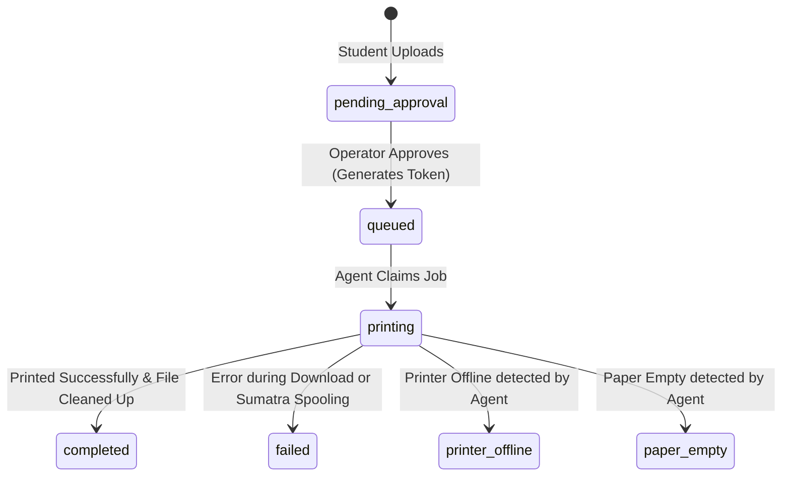
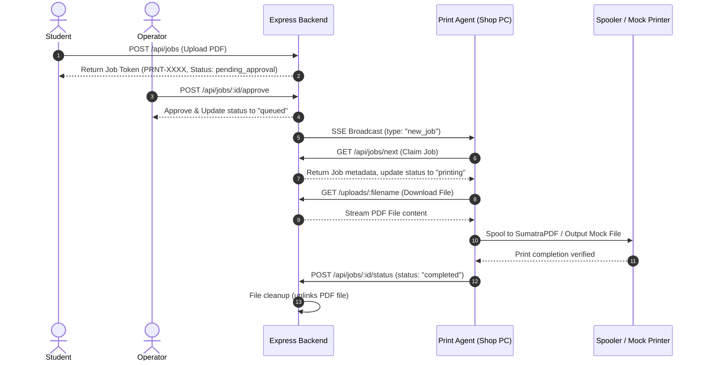

# Campus Print Architecture Bible

This document is the authoritative engineering specification for **Campus Print v1.0.0 RC1**. It traces the architecture directly from the source code, defining system folders, major components, critical functions, database models, API interfaces, and state-machine workflows.

---

## 1. Product Vision & Boundaries
Campus Print is a multi-shop, local-cloud hybrid print management system designed for campus photocopy shops. It allows students to upload documents from their mobile devices, enables shop operators to manage a secure approval queue, and routes printing tasks dynamically to a local Windows Print Agent connected to physical printers.

### Core Boundaries
* **The Cloud/Backend (Express + TS):** Manages metadata, queues, billing, and serves as the SSE communication router.
* **The Web Client (React + TS):** Renders the Student Portal (uploads/billing) and Admin Portal (approval/routing settings).
* **The Local Print Agent (Node.js CJS Daemon):** Runs on a shop PC, maintains a real-time SSE stream, downloads files, and executes physical print commands via SumatraPDF.

---

## 2. Folder Structure & Responsibilities

```text
d:\WEBSITES\campus-printing-queue-and-management-system
├── docs/                       # Core blueprints and pdf technical documentation
├── print-client/               # Windows Print Agent daemon
│   ├── temp/                   # Local staging folder for downloaded PDF jobs
│   ├── printed_output/         # Target output folder for Mock Prints
│   ├── SumatraPDF.exe          # Silent print command line engine
│   └── client.cjs              # Print Client entry point and spooler logic
├── scratch/                    # Verification scripts and Mock Print Lab suites
├── server/                     # Express API server
│   ├── data/                   # Database folder
│   │   └── db.json             # Flat JSON database file
│   ├── uploads/                # Uploaded files from students
│   ├── db.ts                   # In-memory database abstraction layer
│   └── index.ts                # API server endpoints, middleware, and rate limiters
├── src/                        # React Frontend Source
│   ├── components/             # Subsystem portal components
│   │   ├── StudentPortal.tsx   # Student upload portal UI
│   │   ├── AdminPortal.tsx     # Shop operator console UI
│   │   └── OwnerDashboard.tsx  # Global owner configuration panel UI
│   ├── App.tsx                 # Core UI router and SSE listener
│   └── types.ts                # Type definitions for the frontend
├── tsconfig.json               # TypeScript compiler config
└── vite.config.ts              # Vite asset server and proxy router configuration
```

---

## 3. Database Specification (`server/data/db.json`)
The system uses a flat JSON database with atomic file writes.

### Models
1. **Jobs (`DbJob`):** Tracks files, page properties, billing amount, print parameters, state transitions, and timeline metrics.
2. **Shops (`Shop`):** Represents print booths, defining prices, active/configured printers, and operator credentials.
3. **PrinterSettings (`PrinterSettings`):** Legacy/global settings fallback tracking status, discovery list, and overrides.
4. **Agents (`Agent`):** Records active Windows Print Agents, their heartbeats, hostnames, and scan statuses.
5. **Printers (`Printer`):** Tracks dynamically discovered local printer profiles reported by agents.

### Job State Machine Transitions


---

## 4. Critical Function Specifications

### `verifyShopToken(req, res, next)` (Server)
* **Purpose:** Authenticates requests using shop-specific signed HMAC tokens.
* **Called By:** Protected admin endpoints.
* **Possible Failures:** Missing header, malformed token structure, invalid signature (returns `401 Unauthorized`).

### `requireAdmin(req, res, next)` (Server)
* **Purpose:** Verifies that a request carries a valid admin credential token or matches `AGENT_TOKEN` or `ADMIN_API_KEY`.
* **Called By:** SSE streams, file download routes, and agent registration.
* **Possible Failures:** Missing header, invalid token (returns `401 Unauthorized`).

### `resolvePrinterForJob(job)` (Print Client)
* **Purpose:** Determines which physical printer to route a job to. Resolves based on job's `printType` (B&W vs. Color) using server-side mappings.
* **Returns:** The name of the mapped printer, `"MockPrinter"` (if mock mode), or the active system default.
* **Possible Failures:** Empty mappings, missing system printers. Falls back to active default.

### `downloadFile(filePath, dest)` (Print Client)
* **Purpose:** Resolves and downloads print job files. Strips out absolute `http`/`https` hosts (preventing localhost leakage) and enforces `config.serverUrl` proxying.
* **Behavior:** Disables socket timeout via `req.setTimeout(0)` upon receiving response headers, ensuring slow transfers complete successfully.

---

## 5. API Reference Bible

| Endpoint | Method | Auth | Purpose |
| :--- | :--- | :--- | :--- |
| `/api/auth/login` | POST | Public | Validates Admin/Owner logins, returning signed shop authorization tokens. |
| `/api/jobs` | POST | Public | Standard upload route for student files. Performs page-counting and pricing. |
| `/api/jobs/next` | GET | `requireAdmin` | Atomic claim route. Fetches the next `queued` job and sets status to `printing`. |
| `/api/jobs/:id/status` | POST | `requireAdmin` | Updates print job status (e.g., `completed`, `failed`). Triggers file cleanup. |
| `/api/jobs/:id/timeline` | POST | `requireAdmin` | Appends telemetry audit metrics (e.g. `downloaded`, `spool_command_sent`). |
| `/api/agent/register` | POST | `requireAdmin` | Registers a new agent profile in the database. |
| `/api/agent/heartbeat` | POST | `requireAdmin` | Receives status heartbeat, active printer lists, and clears scan requests. |
| `/api/jobs/stream` | GET | `requireAdmin` | SSE client connection. Sends real-time event notifications (`new_job`, `scan_printers`). |
| `/uploads/:filename` | GET | `requireAdmin` | Fetches uploaded print files. Blocked from public access. |

---

## 6. End-to-End Workflow Flowchart


