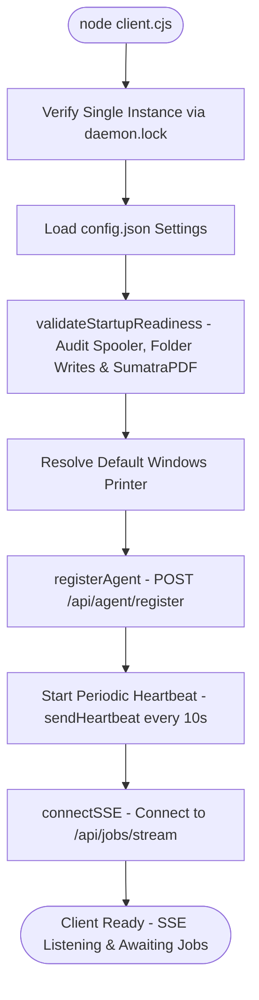
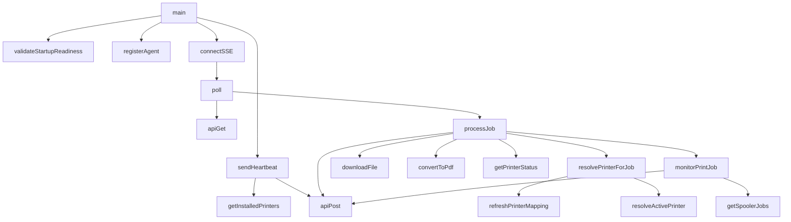
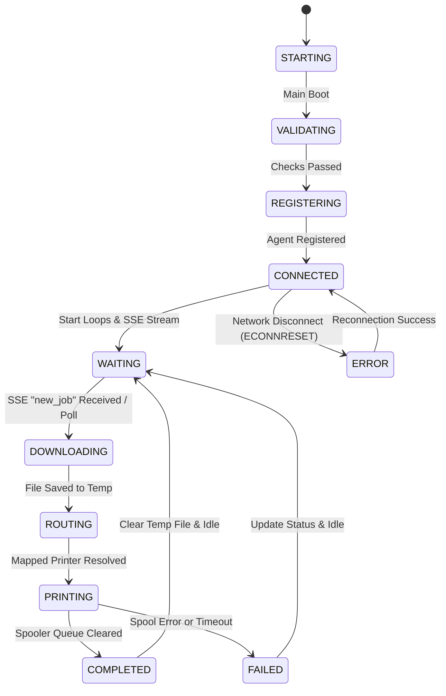

# Campus Print — Print Agent Bible (client.cjs Specification)

This document is the official reverse-engineered engineering reference for the **Campus Print Windows Print Agent** (`print-client/client.cjs`). It defines all modules, sequences, state transitions, call graphs, and dependency maps directly from the source code.

---

## 1. Complete Function Index

Below is the complete function index of `print-client/client.cjs`:

| Function Name | Line Number | Module Category | Short One-Line Purpose |
| :--- | :--- | :--- | :--- |
| `getHttpClient(url)` | 8 | Utilities | Returns the appropriate client module (`http` or `https`) based on protocol. |
| `sanitizeCmdArg(str)` | 12 | Utilities | Sanitizes string command arguments to prevent shell injection attacks. |
| `formatPrinterId(printerName)` | 17 | Utilities | Normalizes a physical printer name into an uppercase alphanumeric ID (e.g. `EPSON_L4360_SERIES`). |
| `refreshPrinterMapping()` | 90 | Configuration / Sync | Pulls and updates the local cache of color and B&W printer assignments from the server. |
| `resolvePrinterForJob(job)` | 107 | Printer Routing | Determines the physical target printer for a job based on B&W/Color mapping or configuration. |
| `getAuthHeader()` | 131 | Authentication | Generates the `Bearer` token authorization header for request headers. |
| `apiGet(endpoint)` | 135 | HTTP Network | Performs a helper GET request returning JSON metadata. Supports socket timeouts. |
| `apiPost(endpoint, body)` | 154 | HTTP Network | Performs a helper POST request sending JSON payloads. Enforces telemetry injects. |
| `downloadFile(filePath, dest)` | 190 | Download Engine | Resolves paths, disables timeout on header receipt (`req.setTimeout(0)`), and downloads print files. |
| `progressBar(current, total)` | 246 | Utilities / UI | Generates a terminal progress bar string for visual printing feedback. |
| `convertToPdf(localPath)` | 253 | Utilities / Spooling | Resolves Word/PowerPoint conversions to printable PDFs (if Office tools are locally present). |
| `ensureSumatraPDF()` | 294 | Spooling Engine | Checks for the SumatraPDF executable, downloading it from GitHub if missing. |
| `showNotification(title, message)` | 332 | Utilities / UI | Spawns Windows balloon/toast notifications using PowerShell scripts. |
| `getDefaultPrinter()` | 354 | Printer Discovery | Invokes PowerShell to identify the active default Windows printer. |
| `getInstalledPrinters()` | 371 | Printer Discovery | Retrieves the list of all printers installed on the Windows system. |
| `getPrinterStatus(printerName)` | 392 | Printer Validation | Fetches real-time printer parameters (status codes, offline state) using WMI queries. |
| `resolveActivePrinter()` | 423 | Printer Routing | Resolves the legacy/fallback printer from config parameters or the system default. |
| `getSpoolerJobs(printerName)` | 444 | Print Spooler | Queries the local print spooler queue for a target printer using WMI queries. |
| `monitorPrintJob(...)` | 469 | Print Spooler / Track | Monitors the active Windows Spooler queue, updating backend progress and detecting errors. |
| `startRecoveryLoop()` | 575 | Recovery Loop | Polls local spooler state to clear stuck jobs or recover print queue status. |
| `processJob(job)` | 611 | Job Processing | Core execution wrapper. Directs claiming, downloading, routing, and spooling print tasks. |
| `poll()` | 873 | Queue Management | Queries `/api/jobs/next` to retrieve and claim outstanding queued jobs from the server. |
| `connectSSE()` | 905 | Realtime Stream | Connects to the Server-Sent Events stream, waiting for server-pushed notifications. |
| `registerAgent()` | 967 | Agent Registration | Registers the local hardware agent profile on the Express server. |
| `sendHeartbeat()` | 986 | Heartbeat Agent | Periodically updates backend online status and pushes the list of discovered local printers. |
| `validateStartupReadiness()` | 1069 | Startup Validation | Audits SumatraPDF, spooler status, config paths, and write permissions on start. |
| `main()` | 1200 | Startup Lifecycle | Entry point. Executes lockfiles, startup checks, registration, starts loops, and SSE. |

---

## 2. Module Classification
* **Configuration / Sync:** `refreshPrinterMapping`
* **Startup / Lifecycle:** `validateStartupReadiness`, `main`
* **Registration:** `registerAgent`
* **Heartbeat:** `sendHeartbeat`
* **SSE Stream:** `connectSSE`
* **Queue Management:** `poll`
* **Job Processing:** `processJob`
* **Download Engine:** `downloadFile`
* **Printer Discovery:** `getDefaultPrinter`, `getInstalledPrinters`, `getPrinterStatus`
* **Printer Routing:** `resolvePrinterForJob`, `resolveActivePrinter`
* **Spooling Engine:** `convertToPdf`, `ensureSumatraPDF`, `getSpoolerJobs`, `monitorPrintJob`
* **Recovery:** `startRecoveryLoop`
* **HTTP Network:** `apiGet`, `apiPost`, `getAuthHeader`, `getHttpClient`
* **Utilities / UI:** `sanitizeCmdArg`, `formatPrinterId`, `progressBar`, `showNotification`

---

## 3. Startup Sequence Flowchart

---

## 4. Call Graph

---

## 5. Critical Function Cards

### Function Name: `main`
* **Purpose:** Initial runtime lifecycle manager.
* **Inputs:** None.
* **Outputs:** None.
* **Called By:** None (process entry).
* **Calls:** `validateStartupReadiness`, `registerAgent`, `sendHeartbeat`, `connectSSE`, `startRecoveryLoop`.
* **Configuration Used:** `config.json` (serverUrl, agentToken).
* **Failure Cases:** Lockfile stale or write block, startup verification failure (exits with code 1).

### Function Name: `processJob`
* **Purpose:** Handles end-to-end execution of a claimed print job.
* **Inputs:** `job` object containing token, printer settings, size, and paths.
* **Outputs:** Promise resolving on completion/fail.
* **Called By:** `poll`.
* **Calls:** `resolvePrinterForJob`, `apiPost`, `downloadFile`, `convertToPdf`, `getPrinterStatus`, `monitorPrintJob`.
* **Failure Cases:** Download timeout, Sumatra spool failure, conversion failures. Rejects and updates status to `failed` on the server.

### Function Name: `downloadFile`
* **Purpose:** Resolves and downloads job files from server to local temp folders.
* **Inputs:** `filePath` (source), `dest` (target disk path).
* **Outputs:** Promise.
* **Called By:** `processJob`.
* **Calls:** `getAuthHeader`, `getHttpClient`.
* **Failure Cases:** Connection timeout, 404 file missing, 401 Unauthorized. 
* **Recovery:** Call `req.setTimeout(0)` upon headers receipt to preserve active download streams.

---

## 6. Runtime State Machine Transitions

---

## 7. Failure Matrix

| Stage | Responsible Function | Possible Failure | Observable Symptom | Log Message | Recovery Mechanism | Verification Procedure |
| :--- | :--- | :--- | :--- | :--- | :--- | :--- |
| **Startup** | `main()` | Stale lockfile | Process exits immediately | `[STARTUP] Stale lockfile detected...` | Auto-deletes lock if PID is inactive | Run agent twice to check blocking |
| **Registration** | `registerAgent()` | Token mismatch | Registration returns 401 | `Registration failed: HTTP 401` | Periodic loop retry | Check `config.json` agentToken |
| **SSE Connection** | `connectSSE()` | Server reboot / Network drop | Disconnected stream | `SSE connection error: read ECONNRESET` | Auto-reconnect after 10 seconds | Disconnect LAN cable and reconnect |
| **Download** | `downloadFile()` | Buffer timeout | Job status fails | `Download timeout` | `req.setTimeout(0)` on headers receipt | Upload a 3MB PDF and verify spooling |
| **Routing** | `resolvePrinterForJob()` | Mapping missing | Fallback default used | `Mapped printer not configured. Falling back.` | Fallback default resolution | Check dropdowns in Admin dashboard |
| **Printing** | `monitorPrintJob()` | Paper jam / spool crash | Job status fails | `Job failed: Spooler error...` | Status set to `failed` + Snapshot | Put printer offline, print, check error |

---

## 8. Dependency Graph
* **`config.json`:** Directs target `serverUrl`, shop identifier (`shopId`), and credentials (`agentToken`).
* **`SumatraPDF.exe`:** Core silent printing tool execution engine.
* **Windows Print Spooler (WMI/PowerShell):** System APIs used to discover local hardware and query queue status.
* **Express Backend APIs:** Heartbeat, Registration, Claims, and SSE stream endpoints.
* **Local Filesystem:** Temp directories (`/temp`) used to staging downloads, and lockfiles to prevent double process executions.

---

## 9. Print Job Chronological Runtime Timeline
1. **SSE Notification:** `connectSSE` receives event data containing `type: "new_job"`.
2. **Retrieve Job Details:** `poll` sends `GET /api/jobs/next`.
3. **Download Phase:** `processJob` triggers `downloadFile` on `/uploads/filename.pdf` with `Bearer` headers.
4. **Printer Routing:** `resolvePrinterForJob` fetches mapped printer config and sets target queue.
5. **Print Spooling:** SumatraPDF command executed silently.
6. **Queue Monitoring:** `monitorPrintJob` polls local spooler via WMI query.
7. **Complete Broadcast:** `apiPost` updates job status to `completed`.
8. **Server Clean up:** Backend deletes file from disk.

---

## 10. Verification Checklist

- [ ] **Configuration:** `config.json` loaded without parsing exception.
- [ ] **Registration:** `registerAgent` resolves with HTTP 200.
- [ ] **Heartbeat:** Backend logs database heartbeat updates.
- [ ] **SSE Stream:** Console reports `✓ Connected to real-time server stream (SSE).`.
- [ ] **Download:** Target file appears under `print-client/temp/` folder.
- [ ] **Printing:** Output PDF generated in `printed_output/` (mock) or printed physically.
- [ ] **Completion:** Admin dashboard shows print progress updating to 100% and then disappearing.
